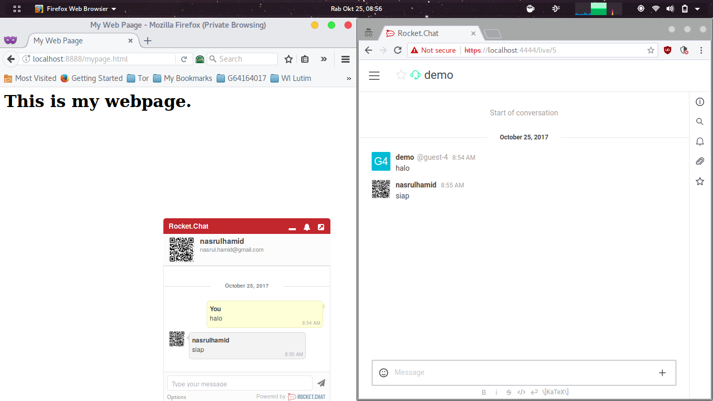

<div id="home" align="center"><a href="https://rocket.chat/"></a></div>

[Sekilas Tentang](#sekilas-tentang) | [Instalasi](#instalasi) | [Konfigurasi](#konfigurasi) | [Otomatisasi](#otomatisasi) | [Cara Pemakaian](#cara-pemakaian) | [Pembahasan](#pembahasan) | [Referensi](#referensi)
:---:|:---:|:---:|:---:|:---:|:---:|:---:

# Sekilas Tentang

[`^ kembali ke atas ^`](#home)

Rocket.Chat adalah solusi obrolan _(chat)_ berbasis _open source_ yang dapat berjalan pada lingkungan desktop menggunakan _web browser_ maupun perngkat _mobile_ seperti Android, iOS. Aplikasi ini dinobatkan sebagai top project pada Rookies Open Source Black Duck of the Year pada tahun 2016.

Perusahaan yang dipimpin oleh Gabriel Engel (CEO) ini berbasis di Brazil namun sebagian besar kontributornya berasal dari berbagai belahan dunia. Pesaing utama dari Rocket.Chat di antaranya adalah Slack dan HipChat.

# Instalasi

[`^ kembali ke atas ^`](#home)

Panduan ini dibangun dengan asumsi berikut:
- Sistem operasi: Ubuntu Server 16.04
- Layanan ssh berjalan.
- Layanan Rocket.Chat akan dijalankan pada port 3000

## Prasyarat 

Ref: [[1]](#1)

|Spesifikasi   | VPS (minimal)         | VPS (recommended)    |
|---            |---                    |---|
|_Processor_   |Single core (2 GHz)   |Dual Core (2GHz)   |
|_Memory_      |1 GB RAM              |2 GB RAM|
|Penyimpanan     |30 GB SSD             |40 GB SSD|
|Kapasitas    |<ul><li>Ideal untuk penggunaan hingga 200 pengguna dengan 50 akses secara bersamaan.</li><li>Aktivitas _upload_, _sharing_, dan _bot_ pada level minimum.</li></ul>|<ul><li>Dapat mengakomodir penggunaan hingga 500 pengguna dengan 100 akses secara bersamaan.</li><li>Aktivitas _upload_, _sharing_, dan _bot_ pada level wajar.</li></ul>|

## Instalasi Cepat dengan Snaps (Disarankan)

```bash
sudo snap install rocketchat-server
```

Setelah instalasi selesai, aplikasi langsung aktif pada port 3000 http dan dapat di akses melalui _url_ [http://localhost:3000](http://localhost:3000)

## Instalasi secara Manual

Untuk dapat berjalan dengan semestinya, Rocket.Chat memiliki dependensi / ketergantungan terhadap layanan atau _framework_ yang lain di antaranya:

- Node.js (versi 4.5.0 atau lebih)
- MongoDB
- curl
- graphicsmagick

```bash
# Instal dependensi
sudo apt update
sudo apt install mongodb-server nodejs npm build-essential curl graphicsmagick
sudo npm install -g n
sudo n 4.8.4

# Pastikan mongodb berjalan
sudo service mongodb start

# Download Rocket.Chat
curl -L https://download.rocket.chat/stable -o rocket.chat.tgz

# Deploy Rocket.Chat
tar zxvf rocket.chat.tgz
mv bundle Rocket.Chat && cd Rocket.Chat/programs/server
sudo npm install

# Set Envirenment Variables
cd ../..
export ROOT_URL=http://localhost:3000/
export MONGO_URL=mongodb://localhost:27017/rocketchat
export PORT=3000
export ADMIN_USERNAME=adminusername
export ADMIN_PASS=adminpassword
export ADMIN_EMAIL=adminemail@example.com
node main.js
```
<!---->

Jika proses _startup_ berhasil, cli menampilkan informasi seperti berikut:
```bash
➔ System ➔ startup
➔ +------------------------------------------+
➔ |              SERVER RUNNING              |
➔ +------------------------------------------+
➔ |                                          |
➔ |  Rocket.Chat Version: 0.59.1             |
➔ |       NodeJS Version: 4.8.4 - x64        |
➔ |             Platform: linux              |
➔ |         Process Port: 3000               |
➔ |             Site URL: http://localhost/  |
➔ |     ReplicaSet OpLog: Disabled           |
➔ |          Commit Hash: 0710c94d6a         |
➔ |        Commit Branch: HEAD               |
➔ |                                          |
➔ +------------------------------------------+
```
Hal ini mengindikasikan bahwa layanan Rocket.Chat sudah berjalan pada port 3000 http dan dapat diakses melalui _url_ [http://localhost:3000](http://localhost:3000)

> Diperlukan wewenang sudo untuk menjalankan layanan pada port _default_ http 80. Hal ini dapat dilakukan dengan perintah berikut:
> 
> ```bash
> sudo ROOT_URL=http://localhost/ \
>      MONGO_URL=mongodb://localhost:27017/rocketchat \
>      PORT=3000 \
>      node main.js
> ```

# Konfigurasi

[`^ kembali ke atas ^`](#home)

## Penanganan SSL (Opsional)

Rocket.Chat sebagai aplikasi tingkat menengah tidak dapat menangani layanan SSL sendirian. Tugas tersebut dapat diserahkannya kepada web server lain seperti nginx. Metode ini disebut _reverse proxy_.

```bash
# instalasi web server nginx
sudo apt install nginx
```

### Membuat Self-Signed Certificate

```bash
sudo mkdir /etc/nginx/ssl
sudo openssl req -x509 -nodes -days 365 -newkey rsa:2048 
     -keyout /etc/nginx/ssl/nginx.key
     -out /etc/nginx/ssl/nginx.crt
```

### Konfigurasi Nginx untuk penanganan SSL

Sesuaikan file konfigurasi /etc/nginx/sites-enabled/default

```bash
# Upstreams
upstream backend {
    server 127.0.0.1:3000;
}

# http configuration
server {
        listen      80 default_server;
        server_name localhost;
        access_log	off;
        error_log	off;
        ## redirect http to https ##
        return      301 https://$server_name$request_uri;
}

# https configuration
server {
        listen 	443 ssl;

        root 	/var/www/html;
        index 	index.html index.htm;

        server_name localhost;
        ssl_certificate 	/etc/nginx/ssl/nginx.crt;
        ssl_certificate_key	/etc/nginx/ssl/nginx.key;

        location / {
                # try_files $uri $uri/ =404;
                proxy_pass http://backend/;
                proxy_http_version 1.1;
                proxy_set_header Upgrade $http_upgrade;
                proxy_set_header Connection "upgrade";
                proxy_set_header Host $http_host;

                proxy_set_header X-Real-IP $remote_addr;
                proxy_set_header X-Forward-For $proxy_add_x_forwarded_for;
                proxy_set_header X-Forward-Proto http;
                proxy_set_header X-Nginx-Proxy true;

                proxy_redirect off;
        }
}
```

> Pada konfigurasi ini, server sudah memiliki dua layanan web server nginx pada port 443 https dan rocketchat pada port 3000. _Reverse proxy_ dapat bekerja apabila kedua layanan ini berjalan. Karenanya sebelum mengakses _url_ [https://localhost](https://localhost), terlebih dahulu pastikan layanan rocketchat. node ~/Rocket.Chat/main.js telah berjalan.

Dengan _reverse proxy_, _request_ https yang masuk akan ditangani oleh web server nginx kemudian diarahkan ke port 3000 (layanan Rocket.Chat).

## OAuth

OAuth merupakan metode autentikasi meggunakan akun aplikasi lain. Rocket.Chat mendukung beberapa OAuth di antaranya GitHub, Facebook, Google. Fitur ini dapat dikonfigurasi pada Menu **[Administration > OAuth](https://localhost/admin/OAuth)**.


**Client Id** dan **Client Secret** Github dapat diperoleh dari menu [**Settings > Developer settings > OAuth Apps**](https://github.com/settings/developers).


Setelah penyesuaian konfigurasi, tombol login menggunakan OAuth akan muncul pada halaman login.


## Livechat

Fitur Livechat memungkinkan layanan _chat_ diakses dari halaman web layaknya representasi _customer service_. Fitur ini dapat diaktifkan dari menu [**Administration > Livechat**](https://localhost/admin/Livechat).



 Setelah mengaktifkan fitur ini, menu **Livechat Manager** akan ditampilkan pada _side-menu_ untuk mengakomodir pengelolaan Livechat lanjutan di antaranya pengaturan departemen dan _role_ user pada LiveChat.


Pada menu [**Livechat Manager > Installaltion**](https://localhost/livechat-manager/installation) diberikan script _(embed code)_ untuk diletakkan pada halaman web. 


<!--#  Maintenance
https://localhost:4444/admin/Logs
-->

# Otomatisasi

[`^ kembali ke atas ^`](#home)

## Jalankan Rocket.Chat sebagai _service_

Ref: [[2]](#2)

Dengan konfigurasi ini, layanan RocketChat akan berjalan otomatis setiap kali _boot_.

```bash
sudo npm install -g forever forever-service
cd ~/Rocket.Chat
sudo forever-service install -s main.js -e "ROOT_URL=https://localhost/ MONGO_URL=mongodb://localhost:27017/rocketchat PORT=3000" rocketchat
sudo service rocketchat start
```

# Cara Pemakaian

[`^ kembali ke atas ^`](#home)

Pemakaian Rocket.Chat cukup sederhana layaknya aplikasi chat kebanyakan. 

## Registrasi

1. Jika belum memiliki akun Rocket.Chat, pengguna dapat mendaftarkan dirinya dengan mengklik link `Daftarkan akun baru`.


2. Pengguna kemudian dapat memasukkan **nama pengguna**


3. Setelah registrasi / login berhasil, pengguna akan diarahkan ke halaman `Home`.


## Channel

`Channel` dapat diilustrasikan seperti sebuah ruangan berisi beberapa pengguna. Pada implementasi aplikasi _chat_ yang lain fitur ini biasa disebut _Group_. Secara default, pengguna tergabung dalam `channel` **General**.

1. Membuat grup di Rocket.Chat dapat dilakukan dengan meng-klik tanda **“+”** di sebelah kolom **search**.


2. Terdapat beberapa opsi pengaturan `channel`.
- __Private / Public Channel:__ untuk menentukan akses terbatas hanya untuk pengguna yang diundang _(private)_ atau siapa saja _(public)_.
- __Read Only Channel:__ hanya pengguna tertentu yang dapat mengirimkan pesan _(one way)_.

3. Anggota, dapat dimasukkan pada kolom _Invite Pengguna_.


## ShortKey

Beberapa tombol cepat _(ShortKey)_ yang dapat digunakan pada Rocket.Chat antara lain:

|Shortcut key       |Keterangan|
|---|---|
|<kbd>Enter</kbd>   |Kirim pesan|
|<kbd>Shift</kbd> + <kbd>Enter</kbd>|Baris baru|
|`@<people>`      |mengirim notifikasi ke user tertentu|
|`@all`             |mengirim notifikasi ke seluruh member dalam `channel`|
|`@here`|mengirim notifikasi ke pengguna yang sedang aktif|
|`#<channel>`|membuat link / tag `channel`|
|`/create #<channel>`|Membuat `channel`|
|`/archive #<channel>`|Mengarsipkan `channel`|
|`/leave`           |Keluar dari `channel`|
|`/invite @<people>`|Mengundang user untuk bergabung ke dalam `channel` aktif|
|`/invite-all-from #<channel-x>`|Mengundang semua user dalam suatu `channel-x` untuk bergabung ke dalam `channel` aktif|
|`/invite-all-to #<channel-x>`  |Mengundang semua user dalam `channel` aktif untuk bergabung ke `channel-x`|
|`/join #<channel>` |Bergabung ke `channel`|
|`/kick @people`    |Mengelouarkan seseorang dari `channel`|
|`/help`|Memunculkan daftar tombol cepat (Shortcut)|

## Panel Pengaturan dan Pencarian


Pada sisi kanan ruang percakapan terdapat panel pengaturan dan pencarian.

1. **Room Info:** Informasi dan pengaturan ruangan.
Beberapa pengaturan yang dimungkinkan antara lain: nama ruangan, topik, deskripsi, _private / public_, _read only_, _archived_, dan _password_.
2. **Search:** Penelusuran pesan. Regex dibungkinkan.
3. **Members List:** Daftar anggota.
4. **Notifications:** Pengaturan notifikasi
5. **Files List:** Daftar file
6. **Mentions:** Daftar _mention_
7. **Starred Messages:** Daftar pesan yang ditandai (favorit)
8. **Keyboard Shortcuts:** Daftar tombol cepat.
9. **Pinned Messages:** Daftar pinned messages.

# Pembahasan

[`^ kembali ke atas ^`](#home)

Ref: [[3]](#3) [[4]](#4)

Rocket.Chat merupakan _Web Chat Server_ yang dikembangkan dalam _javascript_ dengan menggunakan Meteor fullstack framework. Rocket.Chat dapat menjadi solusi yang bagus untuk komunitas atau perusahaan yang menginginkan layanan _chat_ mereka di-_hosting_ secara _private_. Sebagai aplikasi _open source_ alternatif dari slack, Rocket.Chat memiliki kelebihan antara lain:

1. Dapat di-_hosting_ pada _private server_, sehingga kemanan data layanan _chat_ lebih terjamin dan dapat di kustomisasi sesuai kebutuhan.
2. _Realtime translation_. Rocket.Chat menggunakan teknologi _machine learning_ untuk melakukan _automatic real time translation_ ketika user melakukan _chat_.
3. _Multiplatform_. Rocket.Chat dapat digunakan pada lingkungan Android, IOS, _web based_ dan desktop based.
4. Menyediakan banyak _plugin_, _system integration_, tema tampilan aplikasi dan powerful API.
5. Menyediakan banyak skema autentikasi, seperti LDAP Group Sync, _two-factor authentication_ (2-FA), E2E encryption, SSO, dan mendukung banyak skema authentikasi OAuth.
6. Tidak ada pembatasan jumlah pengguna, _channel_, _searche_, _guest_, pesan dan file.

Di samping kelebihan di atas, Rocket.Chat memiliki beberapa kekurangan yang perlu dipertimbangkan antara lain:

1. Versi _cloud_ dari Rocket.Chat masih berbayar.
2. Karena versi gratis dari Rocket.Chat harus dihosting secara private, pengguna harus memahami pengetahuan instalasi dan _maintenance_ layanan Rocket.Chat.

## Rocket Chat dan Slack

Aplikasi _Chat Service_ lain yang banyak digunakan saat ini adalah *Slack*. Salah satu sebab Slack mejadi aplikasi chat favorit karena mudah diintegrasikan dengan banyak _tools_. Meskipun demikian Slack masih memiliki keterbatasan terutama dalam versi gratisnya, sedangkan versi berbayarnya dibanderol dengan harga untuk satu pengguna aktifnya sebesar $6.67 / bulan untuk versi Standard dan $12.50 / bulan untuk versi Plus. 

Berikut ini beberapa perbandingan antara Slack dan Rocket Chat:


1. Aplikasi Rocket Chat dapat dijalankan pada _private hosting_ dan tersedia pula versi cloud-nya walaupun (berbayar), sedangkan Slack tidak dapat dijalankan pada _private hosting_ melaikan hanya tersedia versi cloud-nya saja.
2. Metode autentikasi yang disediakan Rocket.Chat lebih banyak dibandingkan Slack.
3. Slack lebih mudah diintegrasikan dengan berbagai _tools_ seperti github, trello dan lain sebagainya. Berbeda dengan Rocket.Chat, pengguna perlu melakukan _setup_ sendiri untuk mengintegrasikan Rocket.Chat dengan aplikasi atau tools yang lain.
4. Slack memiliki fungsi pencarian yang _powerfull_. Pengguna dapat melakukan pencarian mendalam terhadap ke dalam file, potongan kode program _(snippet)_, bahkan Slack dapat melakukan pencarian data pada layanan yang diintegrasikan dengannya. Rocket.Chat hanya menyediakan fungsi pencarian yang trivial seperti kebanyakan aplikasi _chat_ lainnya.


# Referensi

[`^ kembali ke atas ^`](#home)

1. <a id="1"></a>[https://docs.rocket.chat/](https://docs.rocket.chat/) Rocket.Chat Documentation - Rocket.Chat
2. <a id="2"></a>[https://www.digitalocean.com/community/tutorials/how-to-...](https://www.digitalocean.com/community/tutorials/how-to-install-configure-and-deploy-rocket-chat-on-ubuntu-14-04) How To Install, Configure, and Deploy Rocket.Chat on Ubuntu 14.04 - DigitalOcean
3. <a id="3"></a>[https://obviate.io/2015/09/25/why-slack-when-you-can-rocket-chat/](https://obviate.io/2015/09/25/why-slack-when-you-can-rocket-chat/) - Rocket.Chat Review
4. <a id="4"></a>[https://www.slant.co/versus/4553/10600/~slack_vs_rocket-chat](https://www.slant.co/versus/4553/10600/~slack_vs_rocket-chat) - User base vote on Compariton Rocket.Chat and Slack